# Building a personal website

1. Creating a design on Figma
2. Building your website with HTML, CSS, JavaScript
3. Deploying your website with Github Pages

## Creating a design with Figma (optional but recommended)

1. Go to [figma.com](https://www.figma.com/)
2. Create a design file (draft)
3. Create an artboard (press a) and select a screen size

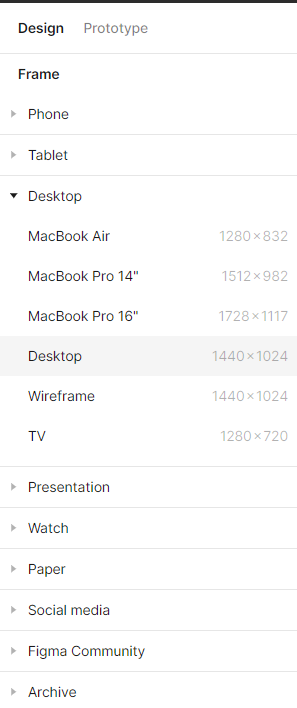

4. Create a design (doesn't have to be complicated) -- here's an [example](https://www.figma.com/file/zboCFwgFABvzwHoXO5PBTG/Personal-Website-(CS-Club)?type=design&node-id=0-1&mode=design&t=9tVi74qfXeGCzjfV-0):

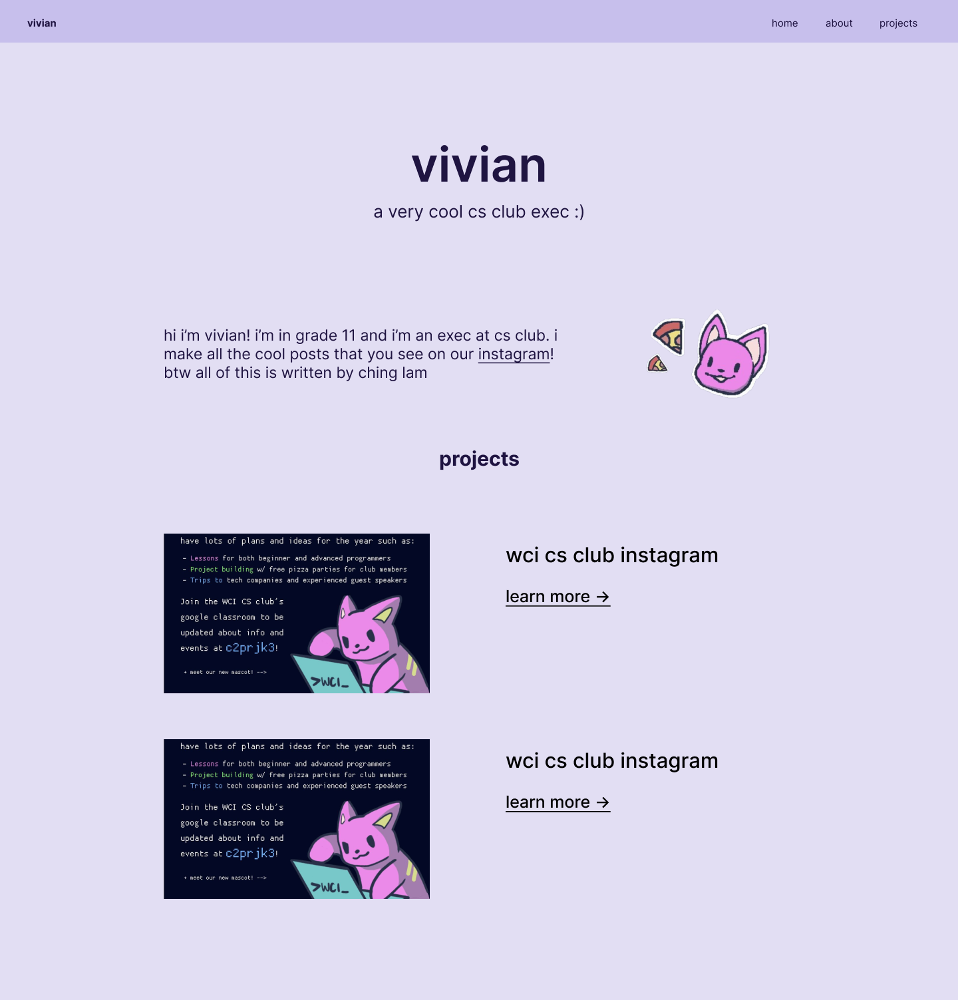

## Building your website with HTML, CSS, JavaScript

HTML - structure of website (text, images)

CSS - styling of website (colours, font sizes)

JavaScript - functionality of website (buttons, alerts)

### HTML Template

```html
<!DOCTYPE html>
<html lang="en">
<head>
    <meta charset="UTF-8">
    <meta name="viewport" content="width=device-width, initial-scale=1.0">
    <title>Document</title>
    <link href="style.css" rel="stylesheet" type="text/css" />
</head>
<body>
    
</body>
</html>
```

### Add div, paragraph, and heading tags

```html
...
<body>
    <div>
        <h2>vivian</h2>
        <p>a very cool cs club exec :)</p>
    </div>
</body>
```

Result:

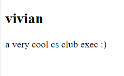

There are a lot more [HTML tags](https://www.w3schools.com/tags/).

### Styling with CSS

Remove all margins and paddings by default (personal preference):
```css
* {
    margin: 0;
    padding: 0;
}
```

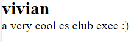

Adding a class name:

```html
<body>
    <div class="landing">
        <h2>vivian</h2>
        <p>a very cool cs club exec :)</p>
    </div>
</body>
```

Adding a background colour:
```css
body {
    background-color: #E2DEF3;
}
```

Changing font size:
```css
.landing h2 {
    font-size: 5rem;
}

.landing p {
    font-size: 2rem;
}
```

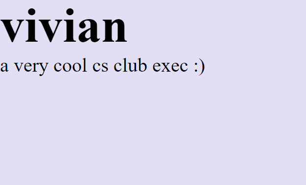

Center the text (horizontally):
```css
.landing {
    width: 100vw;
    margin-top: 150px;
    margin-bottom: 150px;
    display: flex;
    flex-direction: column;
    align-items: center;
}
```

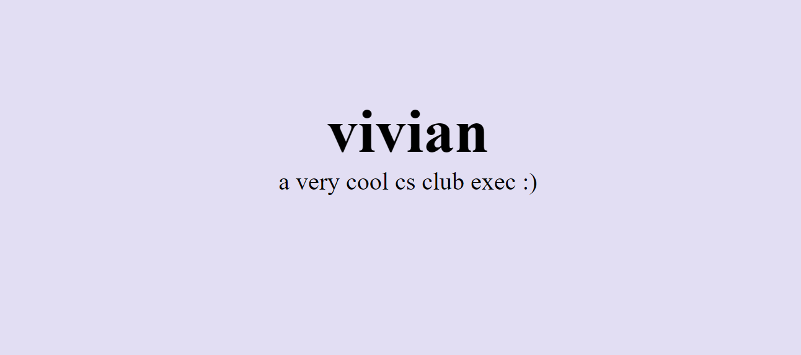

### About section

```html
<div class="about">
    <p>hi i’m vivian! i’m in grade 11 and i’m an exec at cs club. i make all the cool posts that you see on our <a href="https://www.instagram.com/wci_computer_science">instagram</a>! btw all of this is written by ching lam</p>
    
</div>
```

`a - link, img - image`

```css
.about {
    width: 100vw;
    display: flex;
    justify-content: center;
}

.about p {
    font-size: 1.5rem;
    width: 40vw;
    margin-top: 40px;
    margin-right: 50px;
}

.about img {
    height: 200px;
}
```

Read more about [CSS Flexbox](https://css-tricks.com/snippets/css/a-guide-to-flexbox/).

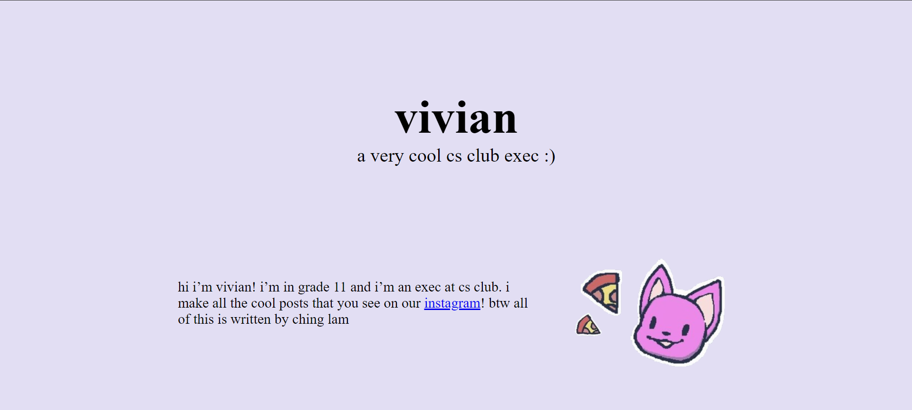

The projects section is a bit more complicated (left as an exercise for the reader).

### Changing the font style

You can use any font from [Google Fonts](https://fonts.google.com/)!

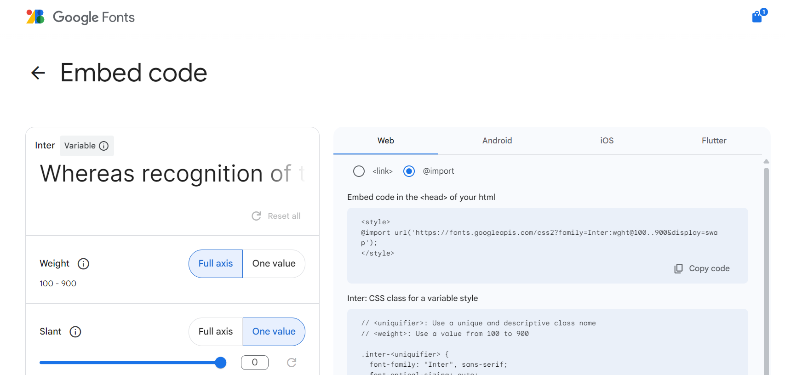

Put this at the top of your CSS file:

```css
@import url('https://fonts.googleapis.com/css2?family=Inter:wght@100..900&display=swap');
```

Change font family:
```css
body {
    ...
    font-family: "Inter", sans-serif;
}
```

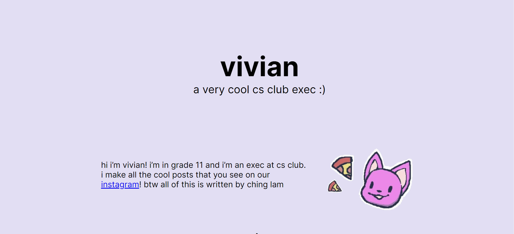

### Links

Adding link hover effects:

```css
.project a:hover {
    color: red;
}
```

Search up `transition` to add smooth transitions.

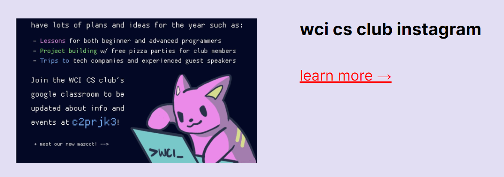

### Add a navbar

```html
<body>
    <div class="navbar">
        <a href="">vivian</a>
    </div>
    <div class="landing">
        ...
    ...
```

```css
.navbar {
    background-color: #C7BFEC;
    position: fixed;
    left: 0;
    top: 0;
    width: 100vw;
    padding: 15px 40px;
}
```

The navbar is fixed to the top of the screen:

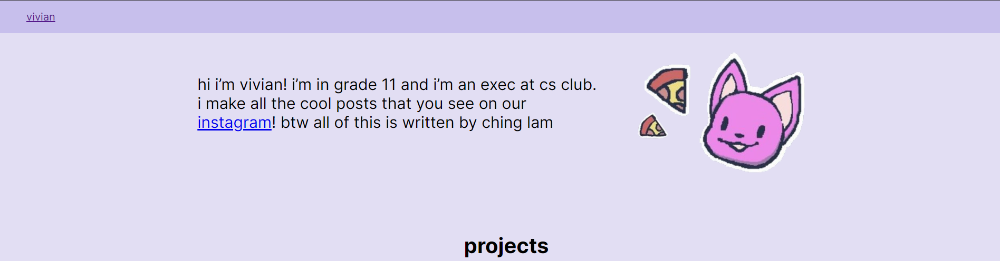

Final note: Don't worry if you don't know everything before you start, you can search up what you don't know while you're building your website.

## Deploying your website with Github Pages

### Push commits onto Github

Option 1 - Push changes from your computer

   - Download Git: https://git-scm.com/downloads
   - Commit all changes 
     - `git add .`
     - `git commit -m "commit message"`

Option 2 - You can upload files directly to a Github repository

### Create Github repository + Github Pages

1. Create a Github account: https://github.com/
2. Create a Github repository - click "New" button on home page (make sure it's public)
   - Option 1: Follow instructions on repo to push changes
   - Option 2: Upload files directly
3. Go to Settings > Pages
4. Select the main branch to deploy and save (might take a few minutes)

Your website is deployed on https://[username].github.io/[repo-name]/

Get yourself bubble tea! (from Hack Club) -> 
https://hackclub.github.io/boba-drops/